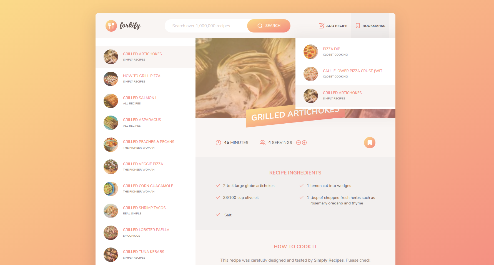

# How to start

1/ npm i 
2/ npm start 
3/ make sure you have Internet connexion , this application uses Web API  
4/ click in the link to provided to localhost

# Front_End_Forkify

This is a UI side JavaScript based code . 

## Tools used

1/Parcel package. 
2/Core-js and regenerator-runtime. 
3/Promises. 
4/MVC architecture. . 
5/web API. 

# Notes

the HTML and CSS/SASS is not created by me(Ben_Ali_Hamza) .

### ScreenShots :

|                 _Home_                  |                    Search                     |                    _Add recipe_                     |                    _Boorkmars_                     |                                              | Recipe |
| :-------------------------------------: | :-------------------------------------------: | :-------------------------------------------------: | :------------------------------------------------: | :------------------------------------------: | ------ |
|  | ) | ) | ) | ) |
